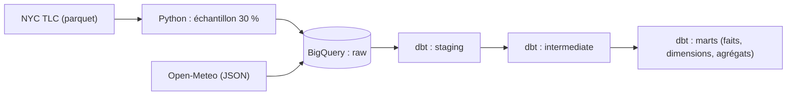

# Marketplace Rider Pay & Experimentation Platform

Plateforme analytics (BigQuery, dbt, Python) construite sur 12,2 millions de courses VTC de New York,
pour mesurer le coût de la rémunération des chauffeurs avec des contrôles de qualité à chaque couche.

> **Statut : projet en cours.** Les couches de données (staging, intermediate, marts), leurs tests et leurs
> réconciliations sont terminés. Le simulateur d'incitations, l'analyse A/B, l'intégration continue,
> le dashboard Power BI et l'assistant IA sont à venir (voir « Prochaines étapes »).

## Contexte et question business

Dans une marketplace de livraison ou de VTC, la rémunération des chauffeurs est un poste de coût important.
Avant de modifier un bonus, une équipe doit répondre à trois questions : combien cela coûte, quel effet cela
a, et peut-on se fier aux chiffres ? Ce projet construit les données nécessaires pour y répondre, à partir de
courses publiques de New York (Uber, Lyft).

## Avancement

| Bloc | Statut |
|---|---|
| Ingestion (échantillon, chargement BigQuery) | Fait |
| Staging, intermediate, marts (schéma en étoile) | Fait |
| Tests et réconciliation à chaque couche | Fait |
| Mesure du coût des requêtes | Fait |
| Simulateur d'incitations | À venir |
| Analyse A/B | À venir |
| Intégration continue (GitHub Actions) | À venir |
| Dashboard Power BI | À venir |
| Assistant IA | À venir |

## Sources de données

| Source | Nature | Contenu |
|---|---|---|
| NYC TLC, High Volume For-Hire Vehicle | Réelle | Courses Uber et Lyft, janvier-février 2026 |
| NYC TLC, taxi zone lookup | Réelle | 265 zones et quartiers |
| Open-Meteo (archive) | Réelle | Météo horaire (une station pour toute la ville) |
| Table des riders | **Synthétique** | 5 000 riders générés (seed 42), non utilisés à ce stade |

Les données TLC sont publiques : https://www.nyc.gov/site/tlc/about/tlc-trip-record-data.page.
Météo : https://open-meteo.com (vérifier les conditions d'utilisation et d'attribution sur leur site).

## Architecture



Schéma en étoile : `fct_trips` (une ligne par course) reliée à `dim_zone` (départ et arrivée),
`dim_date`, `dim_operator` et `dim_weather_hour`. Trois agrégats alimenteront le dashboard :
`agg_daily_operator`, `agg_zone_hour` et `agg_zone_congestion`.

## Chiffres clés

- 12 244 353 courses (échantillon aléatoire de 30 %, seed 42), 59 jours, 2 opérateurs
- 14 modèles dbt, 2 seeds, 95 tests
- Écarts de l'échantillon par rapport aux fichiers complets : moins de 0,1 % sur les moyennes

## Choix techniques

Le détail et les alternatives écartées sont dans [docs/decisions.md](docs/decisions.md). Les principaux :

- **Échantillon de 30 %** pour tenir dans les limites du sandbox BigQuery, avec un contrôle de représentativité.
- **Anomalies signalées, jamais supprimées** : des indicateurs (`has_*`, `is_clean_trip`) permettent de les isoler.
- **Heures locales** : les horodatages TLC n'ont pas de fuseau ; ils sont convertis de TIMESTAMP en DATETIME
  sans décalage pour joindre correctement la météo.
- **Partitionnement par plage d'entiers** : le sandbox supprime les partitions par date après 60 jours.
- **Agrégats additifs** : sommes et compteurs, les ratios sont recalculés à partir des sommes.

## Qualité des données

Chaque passage d'une couche à l'autre est contrôlé par un test de réconciliation, plus un test de bout en bout
de la source brute aux agrégats. 35 087 courses (0,29 %) sont signalées comme anormales, et 1,82 % ont une
chronologie incohérente. Détail dans [docs/data_quality.md](docs/data_quality.md).

## Coût des requêtes

Pour une requête sur une journée, la table de faits partitionnée lit 1,47 Mo contre 373,68 Mo pour la vue source.
Méthode, décomposition et limites dans [docs/benchmark.md](docs/benchmark.md).

## Limites

- L'échantillon fait environ 30 % des courses : les volumes et totaux ne représentent pas la réalité,
  les moyennes et ratios restent valables.
- Les données TLC n'ont pas d'identifiant de chauffeur : les riders et, plus tard, l'expérience A/B sont synthétiques.
  Leurs résultats illustreront une méthode, pas un effet réel.
- La marge plateforme (tarif de base moins rémunération) est une approximation : le tarif exclut les taxes et frais.
- La météo vient d'une seule station pour toute la ville.
- 1,82 % des courses ont une chronologie incohérente (voir le rapport de qualité).
- Le sandbox BigQuery supprime les tables après 60 jours : le projet se reconstruit en quelques commandes.

## Comment reproduire le projet

Versions utilisées : Python 3.13, dbt-core 1.12.5, dbt-bigquery 1.12.1.

1. Créer un projet Google Cloud avec le sandbox BigQuery (sans facturation) et installer le Google Cloud CLI.
2. Cloner le dépôt, créer l'environnement et installer les paquets :
```
   python -m venv .venv
   .\.venv\Scripts\Activate.ps1
   pip install -r requirements.txt
```
3. Télécharger depuis la page TLC `fhvhv_tripdata_2026-01.parquet` et `fhvhv_tripdata_2026-02.parquet`
   dans `data/raw`, et `taxi_zone_lookup.csv` dans `data/reference`.
4. Se connecter et renseigner le projet :
```
   gcloud auth application-default login
```
   puis éditer `PROJECT_ID` dans `ingestion/config.py`.
5. Lancer l'ingestion :
```
   python ingestion/01_sample_hvfhv.py
   python ingestion/02_check_sample.py
   python ingestion/03_load_trips_bigquery.py
   python ingestion/04_load_weather.py
   python ingestion/05_generate_riders.py
```
6. Copier `docs/profiles.example.yml` vers `~/.dbt/profiles.yml` et renseigner le Project ID.
7. Construire et tester :
```
   cd dbt_project
   dbt seed
   dbt build
```

## Méthode de travail

Le code a été écrit avec l'aide d'un assistant IA (Claude) pour la génération et la relecture. Les décisions
de conception, les contrôles et les interprétations sont documentés dans `docs/decisions.md`.

## Prochaines étapes

- Simulateur d'incitations : règles de bonus pilotées par des seeds dbt, comparaison de scénarios.
- Analyse A/B : contrôle du déséquilibre d'affectation, test statistique, puissance.
- Intégration continue (GitHub Actions) et alerte sur dérive du coût par course.
- Dashboard Power BI et assistant IA (text-to-SQL avec garde-fous et évaluation).