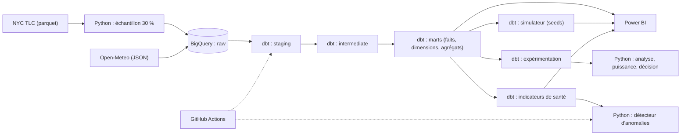
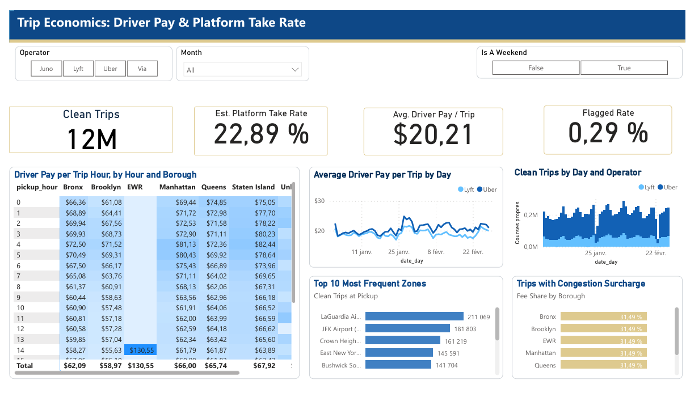
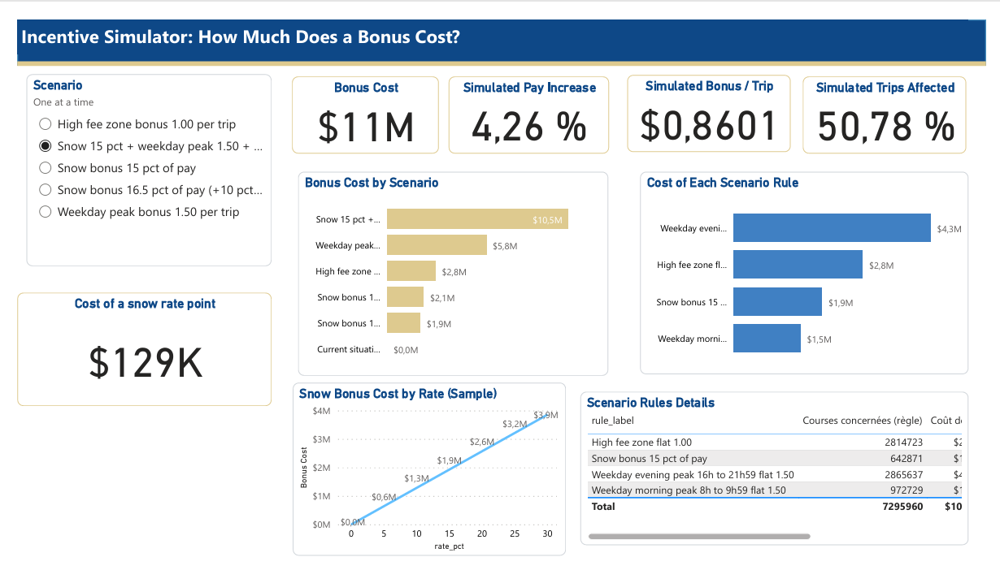
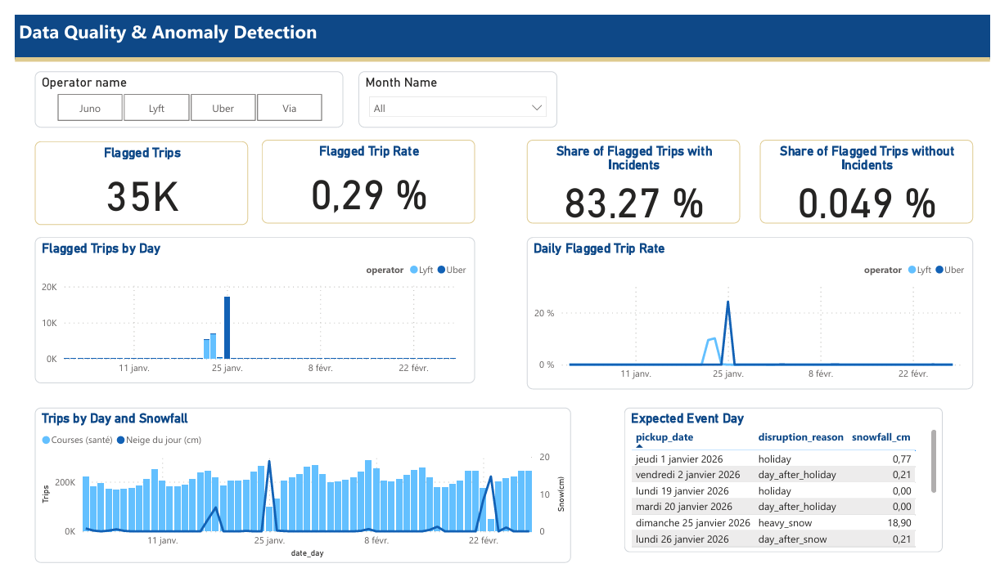
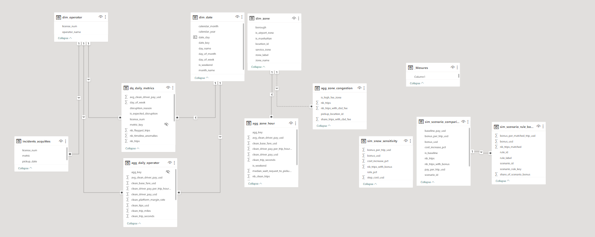

# Marketplace Rider Pay & Experimentation Platform


**In short.** An analytics-engineering project on 12.2M Uber and Lyft trips (30% sample of NYC TLC data, Jan-Feb 2026):
BigQuery and dbt (staging, marts, [161] tests, reconciliation at every layer), a config-driven bonus simulator, a switchback
experiment design with power analysis and a break-even decision rule (the bonus effect is **simulated**), a data-quality monitor
that found three source incidents holding 83% of all flagged trips, and a 3-page Power BI dashboard whose figures are reconciled
against BigQuery.

Plateforme analytics (BigQuery, dbt, Python, Power BI) construite sur 12,2 millions de courses VTC de New York, pour mesurer le coût
de la rémunération des chauffeurs, simuler des changements de bonus, tester leur effet et surveiller la qualité des données.

> **Statut : projet terminé.** [Piste non réalisée : un assistant text-to-SQL avec évaluation chiffrée, écarté pour des raisons de coût et de temps (voir `docs/decisions.md`).]

## Question business

Avant de modifier un bonus de rémunération, une équipe doit répondre à quatre questions : combien cela coûte, quel effet cela a,
cela rapporte-t-il plus que cela ne coûte, et peut-on se fier aux chiffres ? Ce projet construit ce qu'il faut pour y répondre.

## Ce que le projet montre

1. **Les données se réconcilient.** Les 12 244 353 courses sont retrouvées à l'identique de la source brute aux agrégats finaux,
   avec les totaux financiers, grâce à des tests à chaque couche.
2. **Les anomalies sont concentrées.** 35 087 courses (0,29 %) sont signalées, jamais supprimées. 83 % d'entre elles tiennent dans
   trois journées d'incident de la source (Lyft les 22 et 23 janvier, Uber le 25 janvier) ; hors de ces journées, 0,05 %.
3. **Un bonus de pointe coûte cher.** À 1,50 $ par course, il ajoute environ [5,76 M$] à la rémunération de l'échantillon
   (+[2,33] %) et, pour être rentable, il doit faire augmenter les courses d'au moins **31,6 %**.
4. **Une expérience de 78 unités ne tranche pas partout.** L'effet du bonus est simulé : l'expérience valide une méthode. Elle décide
   de façon fiable seulement si l'effet vrai est inférieur à environ 10 % (abandon) ou supérieur à environ 60 % (adoption).
5. **La surveillance retrouve les incidents.** Un détecteur à score robuste a signalé les trois incidents réels, sans fausse alerte
   sur la période, et a été validé par injection d'anomalies connues.

## Avancement

| Bloc | Statut |
|---|---|
| Ingestion (échantillon, chargement BigQuery) | Fait |
| Staging, intermediate, marts (schéma en étoile), tests et réconciliations | Fait |
| Simulateur d'incitations | Fait |
| Expérimentation (switchback, A/A, puissance, seuil de rentabilité) | Fait |
| Surveillance de la qualité des données | Fait |
| Intégration continue (GitHub Actions) | [Fait / Niveau 1 fait, build complet non validé : raison] |
| Tableau de bord Power BI (3 pages, [+ accueil]) | Fait |

## Sources de données

| Source | Nature | Contenu |
|---|---|---|
| NYC TLC, High Volume For-Hire Vehicle | Réelle | Courses Uber et Lyft, janvier-février 2026 |
| NYC TLC, taxi zone lookup | Réelle | 265 zones et quartiers |
| Open-Meteo (archive) | Réelle | Météo horaire, une station pour toute la ville |
| Règles de bonus et scénarios | **Hypothèses** | Seeds dbt |
| Effet du bonus dans l'expérience | **Simulé** | Ajouté au nombre de courses des unités test |
| Table des riders | **Synthétique** | 5 000 riders générés, [non utilisés par l'expérience] |

Les données TLC sont publiques : https://www.nyc.gov/site/tlc/about/tlc-trip-record-data.page.
Météo : Open-Meteo (https://open-meteo.com) ; vérifie leurs conditions d'utilisation et ajoute l'attribution qu'elles exigent.

## Architecture



Schéma en étoile : `fct_trips` (une ligne par course) reliée à `dim_zone`, `dim_date`, `dim_operator` et `dim_weather_hour`, plus trois
agrégats pour le BI.

## Chiffres clés


- 12 244 353 courses, 59 jours, 2 opérateurs
- [23] modèles dbt, [7] seeds, [161] tests
- Écarts de l'échantillon par rapport aux fichiers complets : moins de 0,1 % sur les moyennes
- Requête d'une journée : 1,47 Mo sur la table partitionnée contre 373,68 Mo sur la vue source

## Tableau de bord Power BI


- Fichier : [dashboards/rider_pay.pbix](dashboards/rider_pay.pbix) (Power BI Desktop, Windows)
- Version PDF : [docs/rider_pay_dashboard.pdf](docs/rider_pay_dashboard.pdf)
- Détail du modèle et des mesures : [docs/dashboard.md](docs/dashboard.md)

| Page | Question | Ce qu'on y lit |
|---|---|---|
| 1. Trips Economy | Combien gagne un chauffeur par course, et que garde la plateforme ? | Rémunération moyenne de [20,21] $ par course propre, part plateforme approximative de [22,89] %, matrice heure × quartier |
| 2. Incentive Simulaotor | Combien coûte un bonus, et de quoi ce coût dépend-il ? | Coût par scénario, décomposition par règle (intensité × étendue), sensibilité du bonus neige |
| 3. Data quality | Peut-on se fier aux chiffres, et où sont les incidents ? | [83] % des courses signalées dans trois journées d'incident, [0,05] % hors de ces journées |









**Limites du tableau de bord** : les segmenteurs Opérateur et Mois ne filtrent pas les visuels de zones (ces agrégats n'ont ni date ni
opérateur) ; le coût du simulateur est statique ; « rémunération par heure de course » n'est pas un salaire horaire.

## Les blocs en détail

| Bloc | Document |
|---|---|
| Choix de conception et alternatives écartées | [docs/decisions.md](docs/decisions.md) |
| Qualité des données et incidents | [docs/data_quality.md](docs/data_quality.md) |
| Coût des requêtes | [docs/benchmark.md](docs/benchmark.md) |
| Simulateur d'incitations | [docs/simulator.md](docs/simulator.md) |
| Plan d'expérience | [docs/experiment_design.md](docs/experiment_design.md) |
| Rapport d'expérimentation | [docs/experiment_report.md](docs/experiment_report.md) |
| Surveillance et détecteur | [docs/monitoring.md](docs/monitoring.md) |
| Intégration continue | [docs/ci.md](docs/ci.md) |
| Tableau de bord | [docs/dashboard.md](docs/dashboard.md) |
| Note de cadrage (1 page) | [docs/note_de_cadrage.md](docs/note_de_cadrage.md) |

## Choix techniques

- **Échantillon de 30 %** pour tenir dans les limites du sandbox BigQuery, avec un contrôle de représentativité.
- **Anomalies signalées, jamais supprimées** : des indicateurs (`has_*`, `is_clean_trip`) permettent de les isoler.
- **Heures locales** : les horodatages TLC n'ont pas de fuseau ; ils sont convertis sans décalage pour joindre la météo.
- **Partitionnement par plage d'entiers** : le sandbox supprime les partitions par date après 60 jours.
- **Agrégats additifs** : sommes et compteurs, les ratios sont recalculés à partir des sommes.
- **Switchback plutôt qu'un A/B par chauffeur** : les chauffeurs d'une même zone se partagent les commandes.
- **Détecteur robuste** (médiane et écart absolu médian) : les jours exceptionnels ne faussent pas le « normal ».

## Limites

- L'échantillon fait environ 30 % des courses : les volumes et totaux ne représentent pas la réalité, les moyennes et ratios restent valables.
- Les données TLC n'ont pas d'identifiant de chauffeur ; l'expérience repose sur des jours et des blocs horaires, avec un effet **simulé**.
- Le simulateur calcule un **coût statique** : il ne dit rien du comportement des chauffeurs.
- La marge plateforme (tarif de base moins rémunération) est une **approximation**.
- Une seule station météo pour toute la ville ; 78 unités seulement dans l'expérience.
- Le sandbox BigQuery supprime les tables après 60 jours (la table brute le 5 décembre 2026) : le projet se reconstruit par script, et le fichier Power BI garde les données importées.
- Le détecteur compare chaque jour à la même période de 59 jours : une dérive lente ne serait pas vue.

## Comment reproduire le projet

Versions utilisées : Python 3.13, dbt-core 1.12.5, dbt-bigquery 1.12.1.

1. Créer un projet Google Cloud avec le sandbox BigQuery (sans facturation) et installer le Google Cloud CLI.
2. Cloner le dépôt, créer l'environnement :
```
   python -m venv .venv
   .\.venv\Scripts\Activate.ps1
   pip install -r requirements.txt
```
3. Télécharger depuis la page TLC `fhvhv_tripdata_2026-01.parquet` et `fhvhv_tripdata_2026-02.parquet` dans `data/raw`,
   et `taxi_zone_lookup.csv` dans `data/reference`.
4. `gcloud auth application-default login`, puis renseigner l'identifiant du projet (variable `GCP_PROJECT_ID` ou `ingestion/config.py`).
5. Ingestion :
```
   python ingestion/01_sample_hvfhv.py
   python ingestion/02_check_sample.py
   python ingestion/03_load_trips_bigquery.py
   python ingestion/04_load_weather.py
   python ingestion/05_generate_riders.py
```
6. Copier `docs/profiles.example.yml` vers `~/.dbt/profiles.yml` et renseigner l'identifiant du projet.
7. Construire et tester :
```
   cd dbt_project
   dbt seed
   dbt build
```
8. Expérimentation et surveillance :
```
   python experiments/01_aa_test.py
   python experiments/02_effect_analysis.py
   python experiments/03_power_curve.py
   python experiments/04_decision_analysis.py
   python monitoring/run_checks.py
```

## Structure du dépôt

```
ingestion/      chargement des données
dbt_project/    modèles, seeds, macros, tests
experiments/    analyse de l'expérience (Python)
monitoring/     détecteur d'anomalies, registre des alertes, tests
dashboards/     fichier Power BI et thème
docs/           documentation et rapports
.github/        workflows d'intégration continue
```

## Méthode de travail

Le code a été écrit avec l'aide d'un assistant IA (Claude) pour la génération et la relecture. Les décisions de conception, les contrôles
et les interprétations sont documentés dans `docs/decisions.md`.