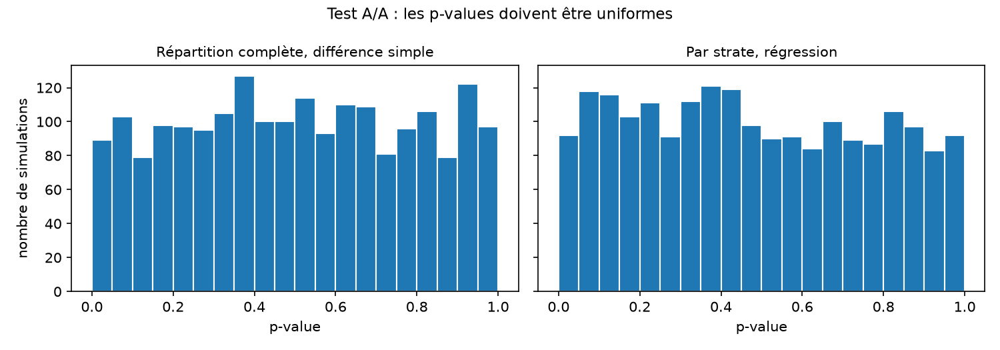
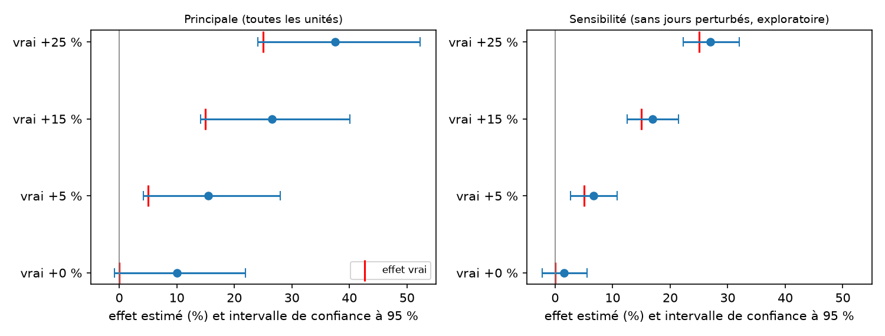
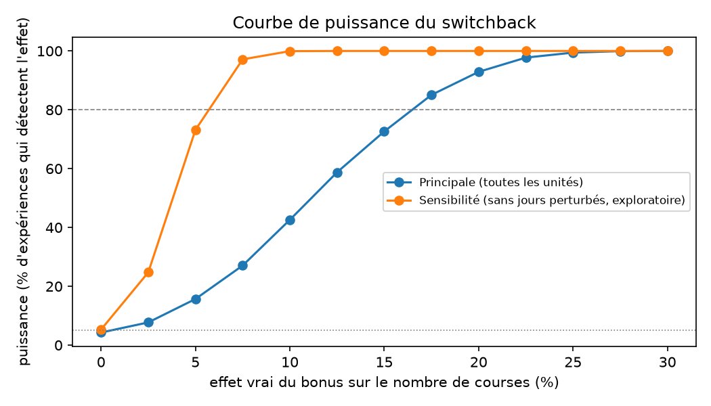
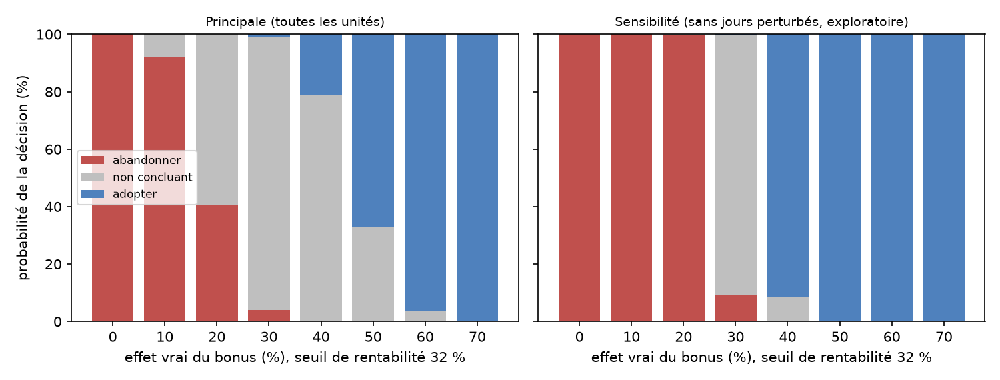

# Rapport d'expérimentation : bonus de pointe en semaine

> L'effet du bonus est **simulé**. Ce rapport valide une méthode d'expérimentation, il ne mesure aucun effet réel.

## Résumé

- Une expérience de type switchback (78 unités : jour de semaine x bloc de pointe) est conçue, répartie au hasard
  de façon reproductible dans dbt et analysée par régression.
- Le test A/A valide la méthode : 4,6 % de faux positifs, pas de biais.
- Avec 78 unités, l'effet minimal détectable à 80 % de puissance est de 16,5 % (5,7 % si l'on retire six unités
  perturbées par des tempêtes et des jours fériés).
- Un bonus de 1,50 $ par course n'est rentable que s'il augmente le nombre de courses d'au moins 31,6 %.
- La règle de décision tranche de façon fiable seulement si l'effet vrai est nettement sous 10 % ou au-dessus de 60 %.

## 1. Question

Un bonus fixe de 1,50 $ par course en heure de pointe en semaine augmente-t-il le nombre de courses,
et est-il rentable ?

## 2. Conception

- **Unité** : un jour de semaine multiplié par un bloc de pointe (matin 8h-9h59, soir 16h-21h59), sur toute la ville
  (switchback). 78 unités après exclusion de trois jours fériés.
- **Pourquoi un switchback** : les chauffeurs d'une même zone se partagent les commandes, donc un A/B par chauffeur
  surestimerait l'effet d'un bonus généralisé (interférence). Voir la section « Pourquoi un switchback » de
  `docs/experiment_design.md`. Le prix du switchback est le petit nombre d'unités, donc une puissance limitée.
- **Répartition** : aléatoire, stratifiée par bloc et jour de la semaine, reproductible (empreinte d'une graine figée),
  dans le modèle dbt `exp_switchback_assignment`. 39 unités test, 39 contrôle.
- **Analyse** : régression du logarithme du nombre de courses sur le traitement, la strate et le nombre d'heures de neige.

## 3. La méthode est validée par un test A/A

2 000 répartitions sans effet : faux positifs de 4,6 % pour la méthode retenue, pas de biais, bruit de 5,25 points.
Une répartition stratifiée analysée par une différence simple donne 0 % de faux positifs : le test est aveugle.

## 4. Effets injectés et estimations

| Effet vrai | Principale (78 unités) | Sensibilité (72 unités) |
|---|---|---|
| 0 % | +10,0 % (-0,8 ; +21,9) | +1,6 % (-2,2 ; +5,6) |
| +5 % | +15,5 % (+4,2 ; +28,0) | +6,7 % (+2,7 ; +10,8) |
| +15 % | +26,5 % (+14,1 ; +40,1) | +16,9 % (+12,5 ; +21,4) |
| +25 % | +37,5 % (+24,1 ; +52,3) | +27,0 % (+22,3 ; +32,0) |

L'intervalle de confiance contient le vrai effet dans les huit cas. Mais un tirage unique peut tromper : le placebo
de l'analyse principale donne +10 %, et un vrai +5 % est estimé à +15,5 %. Six unités sur 78 (tempêtes, lendemain
de tempête, lendemain de jour férié) concentrent presque tout le bruit.

## 5. Puissance

| | Principale | Sensibilité |
|---|---|---|
| Faux positifs | 4,3 % | 5,3 % |
| Effet minimal détectable à 80 % | 16,5 % | 5,7 % |
| Puissance à +5 % | 16 % | 73 % |
| Durée pour détecter +5 % | environ 70 semaines | environ 8 semaines |
| Effet estimé moyen si détecté (vrai +5 %) | 13,6 % | 5,9 % |

La dernière ligne est la malédiction du gagnant : à faible puissance, un résultat significatif surestime l'effet.

## 6. Rentabilité et décision

- **Marge moyenne par course** (approximative, tarif de base moins rémunération) : 6,25 $ (5,78 $ le matin, 6,41 $ le soir).
- **Seuil de rentabilité** : avec un bonus c = 1,50 $ versé sur toutes les courses, y compris les courses
  supplémentaires, le bonus rapporte plus qu'il ne coûte si le nombre de courses augmente d'au moins
  c / (m - c) = **31,6 %** (35,1 % le matin, 30,5 % le soir).
- **Coût du bonus par course supplémentaire** : 31,50 $ à +5 % de courses, 11,50 $ à +15 %, 7,50 $ à +25 %,
  et 6,25 $ (la marge) à l'équilibre.
- **Règle de décision**, fixée à l'avance, sur l'intervalle de confiance à 95 % : adopter si la borne basse dépasse
  le seuil, abandonner si la borne haute est sous le seuil, sinon non concluant.

Sur la répartition réelle :

| Analyse | Effet vrai | Intervalle | Décision |
|---|---|---|---|
| Principale | 0 % | (-0,8 ; 21,9) | abandonner |
| Principale | +5 % | (4,2 ; 28,0) | abandonner |
| Principale | +15 % | (14,1 ; 40,1) | non concluant |
| Principale | +25 % | (24,1 ; 52,3) | non concluant |
| Sensibilité | 0 % | (-2,2 ; 5,6) | abandonner |
| Sensibilité | +5 % | (2,7 ; 10,8) | abandonner |
| Sensibilité | +15 % | (12,5 ; 21,4) | abandonner |
| Sensibilité | +25 % | (22,3 ; 32,0) | non concluant (la borne haute dépasse le seuil de 0,4 point) |

Aucune décision erronée ; la bonne décision est « abandonner » dans les huit cas, puisque aucun effet injecté
n'atteint 31,6 %.

Probabilité de chaque décision selon l'effet vrai (5 000 répartitions) :

| Effet vrai | Principale : abandonner / non concluant / adopter | Sensibilité : abandonner / non concluant / adopter |
|---|---|---|
| 10 % | 92 % / 8 % / 0 % | 100 % / 0 % / 0 % |
| 20 % | 41 % / 59 % / 0 % | 100 % / 0 % / 0 % |
| 30 % | 4 % / 95 % / 1 % | 9 % / 91 % / 0 % |
| 40 % | 0 % / 79 % / 21 % | 0 % / 9 % / 92 % |
| 50 % | 0 % / 33 % / 67 % | 0 % / 0 % / 100 % |
| 60 % | 0 % / 4 % / 97 % | 0 % / 0 % / 100 % |

**Zone grise.** La règle est prudente : les décisions erronées sont rares (à +30 %, 0,9 % d'adoptions à tort pour
l'analyse principale). Avec 78 unités, elle ne tranche de façon fiable que si l'effet vrai est sous environ 10 %
(abandon dans 92 % des cas) ou au-dessus d'environ 60 % (adoption dans 96,5 % des cas) ; entre les deux, elle répond
le plus souvent « non concluant ». Hors jours perturbés, la zone grise se réduit à environ 25-38 %.

## 7. Conclusion

- **La méthode est validée** : calibrée (4,6 % de faux positifs), sans biais, et l'intervalle de confiance retrouve
  le vrai effet dans les huit cas injectés.
- **Ce que l'expérience peut voir** : des effets d'au moins 16,5 % (5,7 % hors jours perturbés). Un effet de +5 % n'est
  détecté que dans 16 % des tirages de l'analyse principale.
- **Ce que l'expérience peut décider** : abandonner un bonus dont l'effet serait modeste (92 % des cas à 10 %), mais
  pas trancher entre 20 % et 50 %. Adopter exigerait un effet d'environ 60 %.
- **Ce que le bonus doit produire** : 31,6 % de courses en plus pour être rentable sur la seule marge, soit environ
  4,3 % de courses en plus pour chaque 1 % de rémunération en plus (le bonus représente 7,3 % de la rémunération moyenne).
- **Pour une expérience réelle** : prévoir une durée suffisante (environ 8 semaines hors jours perturbés pour voir +5 %),
  fixer à l'avance une règle d'exclusion fondée sur la météo et le calendrier, présenter tout résultat avec son
  intervalle de confiance et sa puissance, et ne jamais décider sur une estimation isolée.

## 8. Limites

- L'effet est simulé : le rapport valide une méthode, pas un effet réel.
- Le nombre de courses réalisées mélange offre et demande. La marge est approximative et le seuil de rentabilité
  ne tient compte ni de la fidélisation ni de coûts fixes. Il diffère entre le matin et le soir, et l'expérience
  mesure un effet moyen des deux blocs.
- 78 unités seulement, une seule station météo, report possible entre le matin et le soir.
- La puissance est calculée en considérant ces 78 unités comme fixes : elle ne vaut pas pour d'autres jours.
- Les décisions qui basculent pour quelques dixièmes de point (sensibilité à +25 %) ne sont pas fiables.